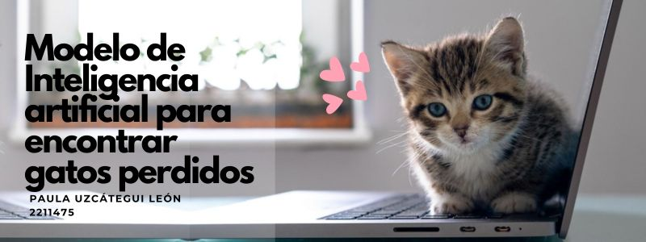

**Titulo:** Modelo de inteligencia artificial para encontrar gatos perdidos

**Autor:** Paula Uzcátegui León

**Objetivo**: Emparejar la imagen de un gato con imágenes de gatos muy similares

**Dataset**: `train.py` y `val.py` contienen en total 1416 gatos diferentes. Son imágenes de tamaño (224,224,3) prerpocesadas con una red yolov8 para recortar la cata del gato. Las fuentes son un formulario, web scrapping de esta [página](https://www.petfinder.com/) y de un [dataset de kaggle](https://www.kaggle.com/datasets/aleksandrdremov/cat-faces-detection). Las imágenes están en formato de byte spor lo que deben ser convertidas a array.

**Modelos**: contrastive learning, siamese network, EfficientNetB2, YoloV8, TripletLoss

Enlaces del código, video, repositorio y diapositivas.

